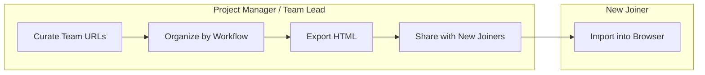

# Bookmark File Editor

Single-file HTML app for editing browser bookmark export files.

- No install
- No build step
- No upload
- Works by opening `index.html` in a browser

## What It Does

- Open exported bookmark `.html` / `.htm` files
- Add, edit, move, sort, and delete bookmarks
- Add and rename folders
- Search titles and URLs
- Export a browser-compatible bookmark HTML file

## How To Use

1. Open `index.html`.
2. Click **Open bookmark file**.
3. Choose a bookmark HTML file exported from your browser.
4. Edit the folders and URLs.
5. Click **Export HTML**.
6. Import the new file back into your browser.

## Project Management Onboarding Use Case

Project managers and team leads can use this to prepare a clean bookmark file for new joiners.

The goal is to give people one organized import with the tools they need on day one: CRM, project boards, design files, docs, reports, and internal processes.



Example:

```text
Project Team Bookmarks
+-- Start Here
|   +-- Team handbook
|   +-- Project overview
|   +-- Onboarding checklist
+-- CRM & Sales
|   +-- Salesforce / HubSpot
|   +-- Customer accounts
|   +-- Pipeline dashboard
+-- Project Delivery
|   +-- Jira / Linear / Asana
|   +-- Sprint board
|   +-- Roadmap
+-- Design & Product
|   +-- Figma
|   +-- Product specs
|   +-- Design system
+-- Docs & Knowledge
|   +-- Notion / Confluence
|   +-- Meeting notes
|   +-- Process docs
+-- Reporting
    +-- BI dashboard
    +-- OKRs
    +-- Status reports
```

## Browser Support

The app reads and writes the standard Netscape bookmark HTML format used by most browsers.

## Development

Edit `index.html` directly.

Optional local preview:

```bash
python -m http.server 4173 --bind 127.0.0.1
```

Open:

```text
http://127.0.0.1:4173/index.html
```
